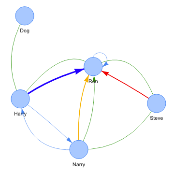

netvissoc
=========

CLI network creation tool and graph visualization for social networks



[](https://oclif.io)
[](https://npmjs.org/package/netvissoc)
[](https://npmjs.org/package/netvissoc)
[](https://github.com/Coreball/netvissoc/blob/master/package.json)

<!-- toc -->
* [Usage](#usage)
* [Commands](#commands)
<!-- tocstop -->
# Usage
<!-- usage -->
```sh-session
$ npm install -g netvissoc
$ netvissoc COMMAND
running command...
$ netvissoc (-v|--version|version)
netvissoc/0.0.0 darwin-x64 node-v15.5.1
$ netvissoc --help [COMMAND]
USAGE
  $ netvissoc COMMAND
...
```
<!-- usagestop -->
# Commands
<!-- commands -->
* [`netvissoc add NAME`](#netvissoc-add-name)
* [`netvissoc check`](#netvissoc-check)
* [`netvissoc delete NAME`](#netvissoc-delete-name)
* [`netvissoc graph`](#netvissoc-graph)
* [`netvissoc help [COMMAND]`](#netvissoc-help-command)
* [`netvissoc link FROM TO TYPE`](#netvissoc-link-from-to-type)
* [`netvissoc list`](#netvissoc-list)
* [`netvissoc relink FROM TO OLD [NEW]`](#netvissoc-relink-from-to-old-new)
* [`netvissoc rename OLD NEW`](#netvissoc-rename-old-new)
* [`netvissoc unlink FROM TO TYPE`](#netvissoc-unlink-from-to-type)

## `netvissoc add NAME`

add a new node without connections

```
USAGE
  $ netvissoc add NAME

ARGUMENTS
  NAME  name(s) to be added, comma-separated

OPTIONS
  -h, --help           show CLI help
  -i, --input=input    [default: .] input directory
  -n, --notes=notes    optional notes
  -o, --output=output  [default: .] output directory

EXAMPLES
  $ netvissoc add -i ./test -o ./test "Adam Ewing" -n "An American lawyer from San Francisco"
  $ netvissoc add -i ./test -o ./test "Adam Ewing, Henry Goose"
```

_See code: [src/commands/add.ts](https://github.com/Coreball/netvissoc/blob/v0.0.0/src/commands/add.ts)_

## `netvissoc check`

check for and display potential problems with input files

```
USAGE
  $ netvissoc check

OPTIONS
  -h, --help         show CLI help
  -i, --input=input  [default: .] input directory

EXAMPLE
  $ netvissoc check -i ./test
```

_See code: [src/commands/check.ts](https://github.com/Coreball/netvissoc/blob/v0.0.0/src/commands/check.ts)_

## `netvissoc delete NAME`

remove all occurrences of name and delete corresponding file

```
USAGE
  $ netvissoc delete NAME

ARGUMENTS
  NAME  name(s) to be deleted, comma-separated

OPTIONS
  -h, --help           show CLI help
  -i, --input=input    [default: .] input directory
  -o, --output=output  [default: .] output directory

EXAMPLE
  $ netvissoc delete -i ./test -o ./test "Bill Smoke"
```

_See code: [src/commands/delete.ts](https://github.com/Coreball/netvissoc/blob/v0.0.0/src/commands/delete.ts)_

## `netvissoc graph`

open network visualization tool

```
USAGE
  $ netvissoc graph

OPTIONS
  -h, --help  show CLI help
```

_See code: [src/commands/graph.ts](https://github.com/Coreball/netvissoc/blob/v0.0.0/src/commands/graph.ts)_

## `netvissoc help [COMMAND]`

display help for netvissoc

```
USAGE
  $ netvissoc help [COMMAND]

ARGUMENTS
  COMMAND  command to show help for

OPTIONS
  --all  see all commands in CLI
```

_See code: [@oclif/plugin-help](https://github.com/oclif/plugin-help/blob/v3.2.1/src/commands/help.ts)_

## `netvissoc link FROM TO TYPE`

create a new relation between nodes (every pair if multiple)

```
USAGE
  $ netvissoc link FROM TO TYPE

ARGUMENTS
  FROM  starting node(s), comma-separated
  TO    ending node(s), comma-separated
  TYPE  relation type

OPTIONS
  -h, --help           show CLI help
  -i, --input=input    [default: .] input directory
  -n, --notes=notes    relation notes
  -o, --output=output  [default: .] output directory
  -u, --undirected     make edges both ways

EXAMPLE
  $ netvissoc link -i ./test -o ./test "Timothy Cavendish" "Denholme Cavendish" "brother" -u
```

_See code: [src/commands/link.ts](https://github.com/Coreball/netvissoc/blob/v0.0.0/src/commands/link.ts)_

## `netvissoc list`

list nodes and number of connections (extended)

```
USAGE
  $ netvissoc list

OPTIONS
  -h, --help              show CLI help
  -i, --input=input       [default: .] input directory
  -x, --extended          show extra columns
  --columns=columns       only show provided columns (comma-separated)
  --csv                   output is csv format [alias: --output=csv]
  --filter=filter         filter property by partial string matching, ex: name=foo
  --no-header             hide table header from output
  --no-truncate           do not truncate output to fit screen
  --output=csv|json|yaml  output in a more machine friendly format
  --sort=sort             property to sort by (prepend '-' for descending)

EXAMPLE
  $ netvissoc list -i ./test -x
```

_See code: [src/commands/list.ts](https://github.com/Coreball/netvissoc/blob/v0.0.0/src/commands/list.ts)_

## `netvissoc relink FROM TO OLD [NEW]`

change or update a relation between nodes (every pair if multiple)

```
USAGE
  $ netvissoc relink FROM TO OLD [NEW]

ARGUMENTS
  FROM  starting node(s), comma-separated
  TO    ending node(s), comma-separated
  OLD   relation type to change/update
  NEW   relation type to change to (optional)

OPTIONS
  -h, --help           show CLI help
  -i, --input=input    [default: .] input directory
  -n, --notes=notes    updated relation notes
  -o, --output=output  [default: .] output directory
  -u, --undirected     change edges both ways

EXAMPLES
  $ netvissoc relink -i ./test -o ./test "Robert Frobisher" "Vyvyan Ayrs" "music buddy" "music enemy" -u
  $ netvissoc relink -i ./test -o ./test "Luisa Rey" "Rufus Sixsmith" "friend" -n "updated notes"
```

_See code: [src/commands/relink.ts](https://github.com/Coreball/netvissoc/blob/v0.0.0/src/commands/relink.ts)_

## `netvissoc rename OLD NEW`

rename a node

```
USAGE
  $ netvissoc rename OLD NEW

ARGUMENTS
  OLD  old name
  NEW  new name

OPTIONS
  -h, --help           show CLI help
  -i, --input=input    [default: .] input directory
  -o, --output=output  [default: .] output directory

EXAMPLE
  $ netvissoc rename -i ./test -o ./test "Sonmi" "Sonmi-451"
```

_See code: [src/commands/rename.ts](https://github.com/Coreball/netvissoc/blob/v0.0.0/src/commands/rename.ts)_

## `netvissoc unlink FROM TO TYPE`

remove a relation between nodes (every pair if multiple)

```
USAGE
  $ netvissoc unlink FROM TO TYPE

ARGUMENTS
  FROM  starting node(s), comma-separated
  TO    ending node(s), comma-separated
  TYPE  relation type

OPTIONS
  -h, --help           show CLI help
  -i, --input=input    [default: .] input directory
  -o, --output=output  [default: .] output directory
  -u, --undirected     remove edges both ways (if exist)

EXAMPLE
  $ netvissoc unlink -i ./test -o ./test "Zachry" "Meronym" "enemy"
```

_See code: [src/commands/unlink.ts](https://github.com/Coreball/netvissoc/blob/v0.0.0/src/commands/unlink.ts)_
<!-- commandsstop -->
